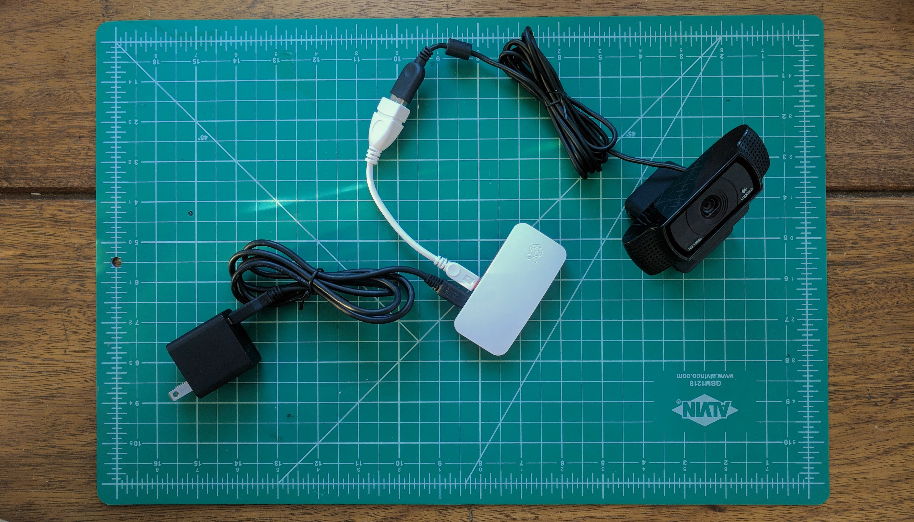

# LakeCam

## Description

Social media is hard. The algorithem expects consistant uploads with unique content, and I just don’t have the time. So I built Lakecam - a Raspberry Pi controlled webcam that posts to Instagram and streams to YouTube. It was developed for "Quaboag Lakecam Project" but could be useful for other applications too! Here's what it does:

1. Reboots every day at noon
2. Waits for network
3. Takes photo
4. Generate's caption
5. Posts to Instagram
6. Starts streaming to rtmp (ie. youtube, twitch, whatever)
7. Keeps streaming until next day at noon, then reboots.
8. Repeat...


## Hardware

* Raspberry Pi Zero W (Use a case with plenty of mounting options)
* 32GB SD Card (With raspbian installed, NOOBS or equivelant)
* Logitech C920 Webcam (Any usb webcam or picam will work)
* Micro USB to Type-A cable (To connect webcam to pi)
* USB Power adapter (Use a good 2A charger)



## Setup

Install raspbian from NOOBS or equivelant. Edit `/etc/wpa_supplicant/wpa_supplicant.conf` with set ssid and password of any future wifi connections. 

```console
network={
    ssid="access-point-name"
    psk="password"
}
```

Install required software.
* [python](https://www.python.org/) - Programming language 
* [weather-util](http://fungi.yuggoth.org/weather/) - fetch weather reports
* [fswebcam](http://www.sanslogic.co.uk/fswebcam/) - take webcam photos
* [imagemagick](https://www.imagemagick.org/) - crop photos for instagram
* [instapy-cli](https://github.com/b3nab/instapy-cli) - post photos to instagram
* [ffmpeg](https://ffmpeg.org/) - stream webcam feed to rtmp

```console
$ sudo apt install weather-util fswebcam imagemagick ffmpeg
$ python3 -m pip install instapy-cli
```

Build `audio.mp3` with 24+hrs of music. Use the royalty-free stuff from the [Free Music Archive](http://freemusicarchive.org/). I used a bulk download browser extension to download 500+ tracks and combined them with and [Audacity](https://www.audacityteam.org/). End product was a single 2.4GB mp3 file with 31hrs of classical music.

Move included scripts and `audio.mp3` to `/home/pi`. Should look like this:

```console
/home/pi/
    ├── main.sh
    ├── 1-wait-for-network.sh
    ├── 2-take-daily-photo.sh
    ├── 3-generate-caption-weather.py
    ├── 4-post-to-instagram.py
    ├── 5-stream-to-youtube.sh
    └── audio.mp3
```

Edit `4-post-to-instagram.py` with instagram account credentials. 

Edit `5-stream-to-livestream.sh` with rtmp stream address + key.
Edit `crontab -e` to reboot every day at noon and run `main.sh` on reboot. Your `crontab -e` should look like this:

```console
00 12 * * * reboot
@reboot sh /home/pi/main.sh
```

Lastly, to wrap things up.

Travel to a scenic location. Connect camera. Mount equipment. Frame shot. Connect to power...and let it run :)

